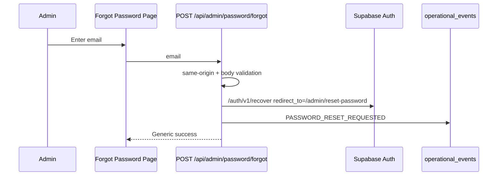
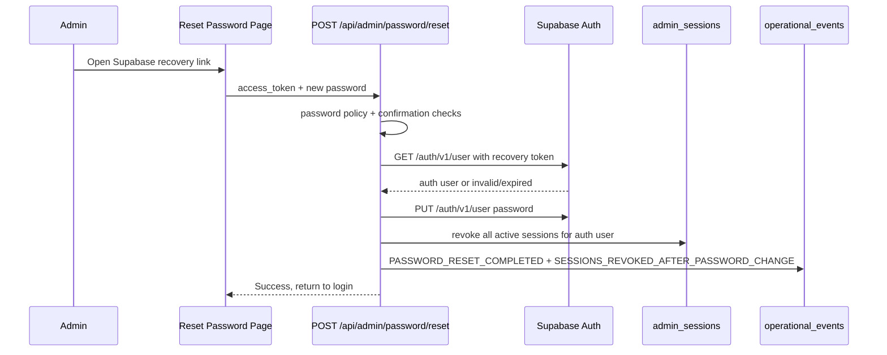
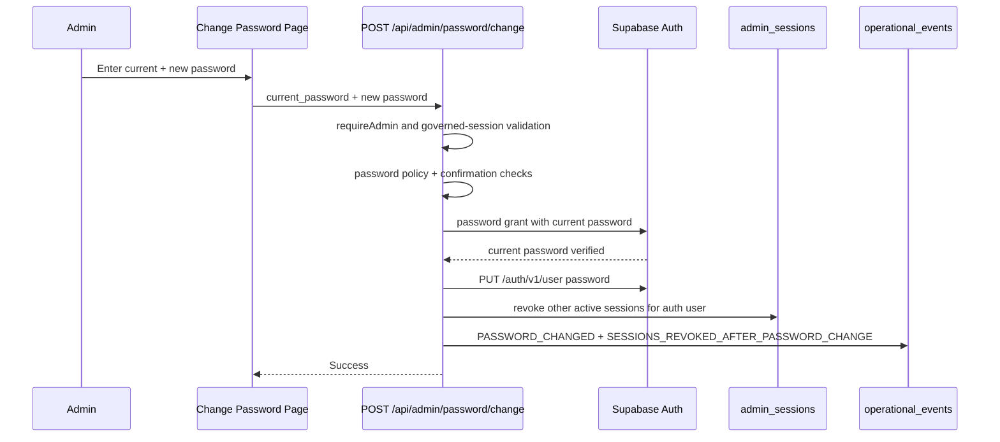

# Admin Auth Security

Admin access uses Supabase Auth plus explicit `admin_users` membership. A successful Supabase password grant is not enough to enter the workspace; the request must also resolve to an active admin membership row.

## Login Flow

```text
Admin login form
↓
POST /api/admin/login
↓
Same-origin request validation
↓
Persistent login protection evaluation
↓
Supabase password grant
↓
Supabase user validation
↓
admin_users membership lookup
↓
governed admin session inventory row
↓
HttpOnly admin cookies
```

The login route preserves the existing session and RBAC model. The security hardening adds a production-grade protection layer before the Supabase password grant and records login outcomes after the attempt.

## Session Governance

Authenticated admin sessions are governed server-side through `admin_sessions`.

The session inventory tracks:

- opaque session id
- auth user id
- admin user id
- login timestamp
- last activity timestamp
- refresh timestamp
- absolute expiry timestamp
- IP address and IP hash
- user agent
- status and revocation reason
- access and refresh token hashes, never raw tokens

The browser receives an additional HttpOnly `localman_admin_session` cookie. The existing access and refresh cookies keep their existing HttpOnly, Secure, SameSite, and path behavior.

Session lifecycle rules:

- idle timeout expires inactive sessions
- absolute timeout expires sessions regardless of activity
- refreshed Supabase sessions update token hashes and refresh timestamps
- activity updates are throttled by `ADMIN_SESSION_ACTIVITY_UPDATE_THRESHOLD_MS`
- logout marks the current session as `logged_out`
- membership removal revokes active sessions for that auth user
- service helpers support revoking current, specific, or all sessions for future admin tools

The admin route still validates Supabase Auth and `admin_users` on every protected request. The governed session adds lifecycle control; it does not replace RBAC.

## Session Lifecycle Diagrams

Login:

```text
POST /api/admin/login
↓
origin + body validation
↓
persistent login protection
↓
Supabase password grant
↓
Supabase user lookup
↓
admin_users lookup
↓
insert admin_sessions row
↓
set access + refresh + session cookies
```

Refresh:

```text
GET /api/admin/session
↓
read refresh cookie
↓
Supabase refresh_token grant
↓
set rotated access + refresh cookies
↓
Supabase user lookup
↓
admin_users lookup
↓
validate admin_sessions row
↓
update refreshed_at, last_activity_at, token hashes
```

Logout:

```text
POST /api/admin/logout
↓
mark admin_sessions row logged_out
↓
call Supabase logout when access token exists
↓
clear access + refresh + session cookies
```

Session expiration:

```text
protected admin request
↓
Supabase user lookup
↓
admin_users lookup
↓
admin_sessions lookup
↓
idle or absolute expiry?
↓
mark idle_expired or absolute_expired
↓
clear cookies and require re-authentication
```

## Persistent Login Protection

Admin login-abuse protection is backed by Supabase Postgres in `admin_login_security_events`.

The protection layers are:

- IP scope
- account/email scope
- combined IP + account scope

Each failed login is persisted to all three scopes. Evaluation checks the persisted event history, so protection survives server restarts and works across multiple application instances.

Protection behavior includes:

- configurable rolling failure windows
- progressive delays before hard cooldown
- temporary cooldowns after repeated failures
- cooldown expiry audit events
- success, failure, delay, rate-limit, and cooldown audit records

The route fails closed with `503 AUTH_PROTECTION_UNAVAILABLE` if the persistent protection store cannot be evaluated. This prevents bypassing login protection during database or configuration failures.

## Configuration

Defaults are centralized in `lib/admin/login-protection.ts`.

Environment overrides:

- `ADMIN_LOGIN_PROTECTION_ENABLED`
- `ADMIN_LOGIN_PROTECTION_TABLE`
- `ADMIN_LOGIN_PROTECTION_IP_MAX_FAILURES`
- `ADMIN_LOGIN_PROTECTION_IP_WINDOW_MS`
- `ADMIN_LOGIN_PROTECTION_IP_COOLDOWN_MS`
- `ADMIN_LOGIN_PROTECTION_ACCOUNT_MAX_FAILURES`
- `ADMIN_LOGIN_PROTECTION_ACCOUNT_WINDOW_MS`
- `ADMIN_LOGIN_PROTECTION_ACCOUNT_COOLDOWN_MS`
- `ADMIN_LOGIN_PROTECTION_IP_ACCOUNT_MAX_FAILURES`
- `ADMIN_LOGIN_PROTECTION_IP_ACCOUNT_WINDOW_MS`
- `ADMIN_LOGIN_PROTECTION_IP_ACCOUNT_COOLDOWN_MS`
- `ADMIN_SESSION_GOVERNANCE_ENABLED`
- `ADMIN_SESSION_GOVERNANCE_TABLE`
- `ADMIN_SESSION_IDLE_TIMEOUT_MS`
- `ADMIN_SESSION_ABSOLUTE_TIMEOUT_MS`
- `ADMIN_SESSION_ACTIVITY_UPDATE_THRESHOLD_MS`
- `ADMIN_PASSWORD_MIN_LENGTH`
- `ADMIN_PASSWORD_REQUIRE_UPPERCASE`
- `ADMIN_PASSWORD_REQUIRE_LOWERCASE`
- `ADMIN_PASSWORD_REQUIRE_NUMBER`
- `ADMIN_PASSWORD_REQUIRE_SPECIAL`
- `ADMIN_PASSWORD_BLOCK_COMMON`

Default policy:

- IP: 20 failures per 10 minutes, 15 minute cooldown
- account: 5 failures per 10 minutes, 15 minute cooldown
- IP + account: 5 failures per 10 minutes, 15 minute cooldown
- admin session idle timeout: 60 minutes
- admin session absolute lifetime: 24 hours
- admin session activity update threshold: 5 minutes
- admin password policy: 12+ characters with uppercase, lowercase, number, special character, and common-password blocking

## Audit Table Access

`admin_login_security_events` is not exposed to public clients. The migration enables RLS and grants table access only to the Supabase service role. Application code accesses it server-side through the login route only.

`admin_sessions` follows the same server-only pattern. RLS is enabled, public/anon/authenticated access is revoked, and only the service role may select, insert, or update rows through protected server routes.

## Regression Lock

Do not replace this layer with process-local memory rate limiting for admin login. Public routes may still use the general abuse-protection helper, but admin login must use persistent distributed protection so the policy is consistent across deployments, server instances, and restarts.

Do not remove governed admin sessions or bypass `admin_sessions` checks for cookie-backed admin sessions. Bearer-token checks used internally by server routes may remain stateless, but browser administrator sessions must preserve idle timeout, absolute timeout, session inventory, and revocation behavior.

## Password Management

Password management uses Supabase Auth as the source of truth. Localman does not create, store, validate, or replay password reset tokens. Reset tokens are issued by Supabase Auth and consumed only through Supabase Auth endpoints.

Routes:

- `POST /api/admin/password/forgot`
- `POST /api/admin/password/reset`
- `POST /api/admin/password/change`

Pages:

- `/admin/forgot-password`
- `/admin/reset-password`
- `/admin/change-password`

Shared authentication UI:

- `components/admin/admin-auth-experience.tsx`
- `components/admin/admin-login-form.tsx`
- `components/admin/admin-password-forms.tsx`

Password policy is centralized in `lib/admin/password-policy.ts`. The default policy requires 12 or more characters, uppercase, lowercase, number, special character, and blocks obvious weak passwords. Environment overrides may tune the policy without duplicating validation rules in routes.

Password audit events are structured operational events and are eligible for durable persistence in `operational_events` when operational event storage is enabled:

- `PASSWORD_RESET_REQUESTED`
- `PASSWORD_RESET_COMPLETED`
- `PASSWORD_CHANGED`
- `PASSWORD_CHANGE_FAILED`
- `INVALID_RESET_TOKEN`
- `EXPIRED_RESET_TOKEN`
- `SESSIONS_REVOKED_AFTER_PASSWORD_CHANGE`

Audit logs must not include raw passwords, reset tokens, access tokens, refresh tokens, or service-role keys. Email values are redacted and hashed before logging.

## Authentication Experience System

The authentication UI is a shared system, not four independent page designs.

The approved login page is the visual baseline. Forgot password, reset password, and change password reuse the same layout, card, fields, button treatment, message presentation, password visibility control, security notice, and responsive behavior.

UI rules:

- no authentication route, API, Supabase Auth call, login-protection rule, session-governance rule, or audit event may be changed for visual polish
- operational warnings and migration banners remain visible
- runtime, validation, rate-limit, password-reset, and session errors must still display
- production users receive safe error copy while internal logging continues
- development warnings remain visible for engineering work
- password strength display is advisory UI; backend password policy remains authoritative

SSR rules:

- server and first client render must match
- browser-only state is evaluated after hydration
- reset recovery hash parsing must not run during initial render
- do not use `dynamic(..., { ssr: false })` to hide authentication hydration problems

### Forgot Password



The response is intentionally generic. Known, unknown, and provider-rejected emails must all receive the same success text after syntactic email validation so the route cannot enumerate admin accounts.

### Reset Password



Invalid and expired links are handled explicitly and audited as `INVALID_RESET_TOKEN` or `EXPIRED_RESET_TOKEN`. Password reset completion revokes all governed admin sessions for the auth user because the reset flow is not tied to an existing trusted browser session.

### Change Password



Authenticated password changes verify the current password through Supabase Auth before updating the password. The current governed session remains active when its session id is known; other active governed sessions for the auth user are revoked. If the current governed session id is unavailable, the helper revokes all active sessions for safety.
