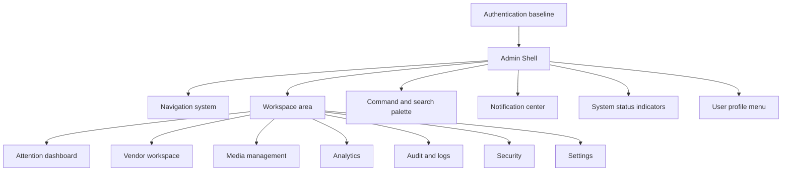
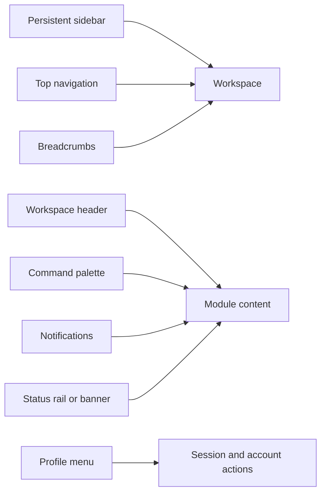
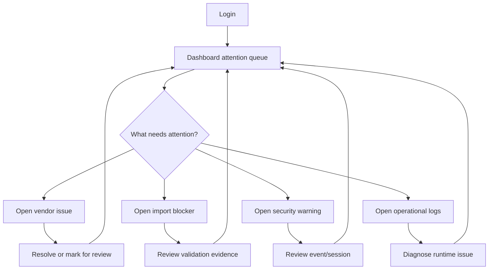
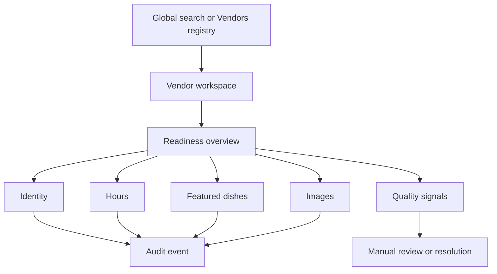
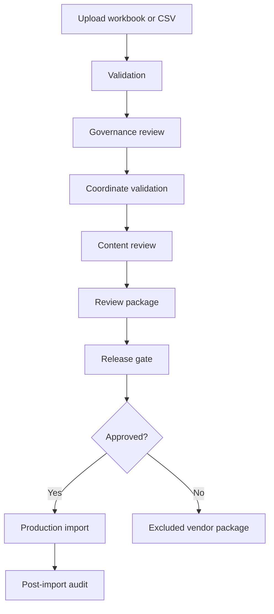
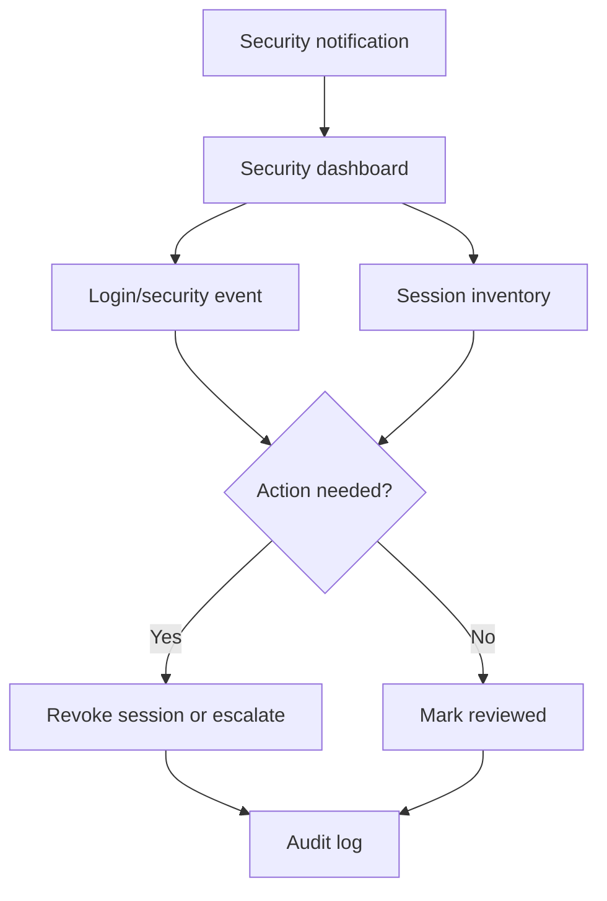

# Localman Admin Portal Architecture

Status: Admin Shell v2 implemented; architecture remains the operating blueprint
Scope: Admin Shell, implemented admin workspaces, and future module architecture
Last updated: 2026-07-02

This document defines the permanent Admin Portal shell architecture for Localman. It records the implemented Admin Shell v2 baseline and the target architecture for future modules. It does not change authentication, discovery, search, map behavior, vendor data, database records, or import behavior.

Authentication Hardening v1.0 is treated as frozen and production-ready. The Admin Shell must build on that baseline without weakening session governance, login protection, password management, audit logging, operational telemetry, or database consistency monitoring.

## 1. Executive Architecture

The Admin Portal should become a durable operational workspace rather than a collection of individual pages. The shell must provide stable navigation, role-aware access, consistent workspace framing, fast cross-module search, visible operational state, and predictable task flows.

The target model is:



Core principle:

1. Authentication protects access.
2. Shell orients the operator.
3. Modules own domain workflows.
4. Shared services provide search, notifications, status, breadcrumbs, actions, and keyboard navigation.

## 2. Current Admin Portal Discovery

### 2.1 Current Routes

Current admin route surface:

| Route | Purpose | Access model |
| --- | --- | --- |
| `/admin` | Role-aware redirect to home | Session role |
| `/admin/dashboard` | Admin dashboard and vendor readiness | Admin only |
| `/admin/agent` | Agent-focused vendor operations | Agent only |
| `/admin/vendors` | Vendor registry and edit entry point | Admin and agent |
| `/admin/vendors/new` | Create vendor workflow | Admin and agent |
| `/admin/vendors/[id]` | Vendor edit workspace | Admin and agent |
| `/admin/riders` | Rider Connect manual intake, review queue, and visibility control | `riders:manage` |
| `/admin/analytics` | Usage and vendor engagement signals | `analytics:read` |
| `/admin/activity` | Admin audit log review | `audit_logs:read` |
| `/admin/logs` | Operational platform logs | `platform_logs:read` |
| `/admin/team` | Admin and agent account management | `admin_users:manage` |
| `/admin/login` | Admin login | Public unauthenticated |
| `/admin/forgot-password` | Password reset request | Public unauthenticated |
| `/admin/reset-password` | Password reset completion | Public unauthenticated with recovery context |
| `/admin/change-password` | Authenticated password change | Authenticated admin/agent |

### 2.2 Current Layout

The current app uses:

- `app/admin/layout.tsx` for session provider wrapping and database consistency warning display.
- `components/admin/admin-shell.tsx` for the sidebar, page title, intro, session block, logout action, and role-aware nav filtering.
- Individual page wrappers that compose `AdminRouteGuard`, `AdminShell`, and the module component.
- `AdminConsole` as a large vendor operations state container for dashboard, agent dashboard, registry, create, and edit modes.
- Dedicated workspace modules for implemented Admin Portal v2 surfaces, including dashboard, vendor workspace, create vendor, and Rider Connect.

### 2.2.1 Implemented Workspace Contracts

Implemented workspaces must preserve the shared shell rhythm:

- left sidebar remains persistent on desktop and collapses responsively
- top search/profile row remains available without blocking workspace forms
- status banners surface readiness, migration, database, and operational warnings
- cards use the shared admin panel treatment, compact headings, and stable control sizing
- mobile and tablet layouts stack without horizontal overflow

Rider Connect workspace contract:

- manual rider intake is visible by default; there is no hidden `Add Rider` pre-step
- rider CSV upload remains a future-state card and must not execute imports
- review queue search and filters remain separate from create intake state
- selected rider verification and visibility edits remain scoped to the selected rider
- operational feedback, duplicate conflict messages, and debug details remain visible to authorized admins
- public rider privacy boundaries remain unchanged

### 2.3 Current Navigation

Current sidebar order:

1. Dashboard
2. Analytics
3. Manage vendors
4. Create vendor
5. Riders
6. Team access
7. Activity
8. Logs

Navigation is currently a flat list. Restricted items are hidden client-side based on the resolved role, while server route guards and API permissions remain authoritative.

### 2.4 Current Workflows

Current workflows include:

- Admin login, logout, forgot password, reset password, change password.
- Role-aware redirect into admin or agent workspace.
- Vendor registry browsing, filtering, selection, editing, creation, image upload, hours updates, and featured dish updates.
- CSV vendor intake from the vendor workspace.
- Dashboard readiness counts.
- Rider Connect manual intake, duplicate-safe creation, review queue filtering, verification, visibility control, structured availability review, contact/report signal review, and external public application access.
- Usage analytics review.
- Audit log review.
- Operational log review.
- Team account creation and role assignment.

### 2.5 Current Pain Points

Observed architecture pain points:

- Navigation is flat and will not scale cleanly as modules grow.
- Shell concerns and module concerns are not cleanly separated yet.
- `AdminConsole` owns many vendor workflows and should be split carefully only when a future module needs it.
- Page wrappers repeat shell and route-guard composition.
- Database consistency blocking logic is repeated in analytics, activity, and logs pages.
- Breadcrumbs are not first-class.
- There is no global command palette or universal search.
- Notifications are not centralized.
- Quick actions are page-local or implicit.
- The sidebar session block is useful but not yet a full profile menu.
- Dashboard v2 now prioritizes readiness, next actions, incomplete vendors, recent activity, and quick links; future work should keep answering what needs attention today rather than adding unrelated statistics.
- Design tokens are implicit in CSS class usage rather than documented as reusable shell-level primitives.

### 2.6 Current Scalability Limits

The current admin surface can support the present pilot, but future modules will put pressure on:

- Navigation density.
- Vendor workspace complexity.
- Cross-module search.
- Notification routing.
- Bulk operations.
- Auditability of operator actions.
- Shared loading, empty, warning, blocked, and degraded states.
- Mobile and tablet operator workflows.
- Keyboard-first navigation.

## 3. Target Shell Model

The permanent shell should be a stable frame around every authenticated admin module.



### 3.1 Shell Responsibilities

The Admin Shell owns:

- Primary navigation.
- Secondary grouped navigation.
- Breadcrumbs.
- Workspace title and context.
- Global search and command entry.
- Notification center.
- User profile and session actions.
- Global status indicators.
- Keyboard shortcut routing.
- Responsive shell behavior.
- Permission-aware presentation.
- Shared layout slots.

The Admin Shell must not own:

- Authentication rules.
- Backend authorization.
- Vendor business logic.
- Import transformation logic.
- Search ranking logic.
- Discovery behavior.
- Map behavior.
- Domain-specific form state.

### 3.2 Module Responsibilities

Each module owns:

- Domain data fetching.
- Domain mutations.
- Local filters.
- Domain table/list/card content.
- Domain-specific empty states.
- Domain-specific validation.
- Domain-specific audit events.
- Domain-specific keyboard shortcuts after focus enters the module.

## 4. Information Architecture

The target information architecture groups admin work by operator intent.

```text
Admin
├── Dashboard
├── Operations
│   ├── Vendors
│   ├── Create Vendor
│   ├── Riders
│   ├── Categories
│   └── Bulk Operations
├── Content
│   ├── Images
│   ├── Featured Dishes
│   ├── Descriptions
│   └── Quality Review
├── Analytics
│   ├── Overview
│   ├── Vendor Performance
│   ├── Search Signals
│   └── Drop-off Signals
├── System
│   ├── Audit Logs
│   ├── Operational Logs
│   ├── Security
│   ├── Database Health
│   └── Release Gates
└── Settings
    ├── Team Access
    ├── Roles and Permissions
    ├── Workspace Preferences
    └── Environment
```

### 4.1 Navigation Map

| Section | Route family | Primary users | Purpose |
| --- | --- | --- | --- |
| Dashboard | `/admin/dashboard`, `/admin/agent` | Admin, agent | Daily attention queue and task launchpad |
| Operations / Vendors | `/admin/vendors`, `/admin/vendors/[id]`, `/admin/vendors/new` | Admin, agent | Vendor registry, creation, edit, readiness |
| Operations / Riders | `/admin/riders` | Admin | Rider application review and visibility control |
| Operations / Categories | Future | Admin | Category governance and mapping review |
| Operations / Bulk Operations | Future | Admin | Batch edits, review queues, import actions |
| Content / Images | Future | Admin, agent | Image review, upload state, missing media queues |
| Content / Featured Dishes | Future | Admin, agent | Dish quality, duplication, review queues |
| Content / Quality Review | Future | Admin | Content QA and approval workflow |
| Analytics | `/admin/analytics` | Admin | Usage signals and operational prioritization |
| System / Audit Logs | `/admin/activity` | Admin | User and mutation audit trail |
| System / Operational Logs | `/admin/logs` | Admin | Runtime warnings, failures, slow requests |
| System / Security | Future | Admin | Login protection, sessions, auth events |
| System / Database Health | Future | Admin | Migration and schema consistency |
| Settings / Team Access | `/admin/team` | Admin | Admin and agent account management |

### 4.2 Sidebar Structure

Recommended sidebar hierarchy:

```text
Dashboard

Operations
  Vendors
  Create Vendor
  Riders
  Categories
  Bulk Operations

Content
  Images
  Featured Dishes
  Quality Review

Analytics
  Overview

System
  Audit Logs
  Operational Logs
  Security
  Database Health

Settings
  Team Access
  Roles and Permissions
```

Agent sidebar should be a permission-filtered version of the same model, not a separate shell:

```text
Dashboard

Operations
  Vendors
  Create Vendor

Content
  Images
  Featured Dishes
  Quality Review
```

Rules:

- Backend RBAC remains authoritative.
- Sidebar filtering is presentation-only.
- Hidden nav items do not grant or remove access.
- Disabled items may be shown only when useful for roadmap visibility; otherwise hide them.
- Keep section labels stable so future modules can be added without reorganizing the whole product.

## 5. Dashboard Architecture

The dashboard should answer:

> What needs my attention today?

It should not be a generic statistics page.

### 5.1 Dashboard Inputs

Dashboard modules should pull from:

- Vendor readiness totals.
- Missing images.
- Missing hours.
- Missing featured dishes.
- Duplicate coordinates.
- Import validation blockers.
- Pending rider reviews.
- Recent failed admin actions.
- Security warnings.
- Pending migrations or database consistency warnings.
- High-priority content quality issues.

### 5.2 Dashboard Sections

Recommended dashboard layout:

1. Attention Queue
   - Highest-priority work requiring action.
   - Examples: vendor missing required data, failed import, security warning, database mismatch.

2. Operational Health
   - Database status, migration status, auth telemetry status, logging status.

3. Vendor Readiness
   - Total vendors, active vendors, missing media, missing hours, missing dishes, needs follow-up.

4. Recent Work
   - Recently edited vendors, latest imports, latest resolved issues.

5. Quick Actions
   - Create vendor.
   - Open vendor.
   - Upload images.
   - Run import validation.
   - View logs.

6. Exceptions
   - Work blocked by unknown governance, invalid coordinates, duplicate slugs, suspicious hours, or failed media.

### 5.3 Dashboard Ranking

Dashboard attention ranking should prioritize:

1. Security and database health issues.
2. Import blockers.
3. Public-facing data integrity issues.
4. Vendor completeness issues.
5. Operational analytics trends.
6. Informational changes.

## 6. Workspace Area

The workspace area is the main content region for modules.

### 6.1 Workspace Slots

Every authenticated workspace page should support these slots:

- `breadcrumb`
- `title`
- `description`
- `status`
- `primaryAction`
- `secondaryActions`
- `filters`
- `content`
- `detailPanel`
- `footerMeta`

### 6.2 Workspace Header

Workspace header should display:

- Breadcrumb trail.
- Page title.
- Short operational description.
- Primary action.
- Contextual secondary actions.
- Status indicator when relevant.

Examples:

- Vendors: primary action `Create vendor`, secondary `Import CSV`.
- Images: primary action `Upload images`, secondary `View missing images`.
- Security: primary action `Review sessions`, secondary `View login events`.

### 6.3 Workspace Modes

Modules should use consistent modes:

- Overview
- Registry
- Detail
- Create
- Edit
- Review
- Bulk action
- Settings

This avoids one component becoming responsible for unrelated workspace states.

## 7. Breadcrumb System

Breadcrumbs should be route-aware and entity-aware.

Examples:

```text
Dashboard
Operations / Vendors
Operations / Vendors / Hajara Kitchen
Operations / Vendors / Create
System / Audit Logs
Settings / Team Access
```

Rules:

- Breadcrumbs must not replace sidebar navigation.
- Breadcrumbs should show hierarchy, not browser history.
- Entity breadcrumbs should use current display name where available.
- Loading entity names should fall back to stable ids or slugs.
- Breadcrumb links must respect role and permission visibility.

## 8. Global Search

Global search should search across the Admin Portal, not public discovery.

### 8.1 Search Targets

Initial targets:

- Vendor name.
- Vendor slug.
- Phone.
- Area.
- Category.
- Featured dish.
- Admin user.
- Rider applicant.
- Audit event.
- Operational event.

Future targets:

- Import batch.
- Image filename.
- Coordinate correction package.
- Release gate.
- Quality review item.
- AI review suggestion.

### 8.2 Search Behavior

Universal search should:

- Be available from the top navigation and command palette.
- Use role-aware result filtering.
- Return grouped results.
- Prefer exact identity matches before fuzzy text matches.
- Show the entity type, status, and likely action.
- Never expose restricted data to unauthorized roles.
- Log operational errors without blocking shell rendering.

Recommended grouping:

```text
Vendors
Riders
Content
Operations
Admin users
Logs
Commands
```

### 8.3 Search Ranking

Admin global search ranking should be separate from public discovery ranking.

Recommended ranking:

1. Exact slug, id, phone, or email match.
2. Exact vendor/business/admin name match.
3. Prefix match.
4. Category or featured dish match.
5. Area match.
6. Recent or frequently opened entities for the current user.

## 9. Command Palette

The command palette should support keyboard-first admin operations.

### 9.1 Entry Points

Recommended keyboard shortcut:

- Primary: `Command+K` on macOS, `Ctrl+K` elsewhere.
- Secondary: `/` when focus is not inside an input.

### 9.2 Command Types

Commands should include:

- Navigate: Go to Dashboard, Vendors, Analytics, Logs, Team.
- Open entity: Open Vendor, Open Rider, Open Admin.
- Create: Create Vendor, Create Admin User.
- Operational: Run Import Validation, Open Missing Images, Open Duplicate Coordinates.
- Security: View Active Sessions, View Login Events, Revoke Session.
- Utility: Copy current vendor slug, copy current URL.

### 9.3 Command Safety

Rules:

- Destructive commands must open confirmation UI, not execute directly.
- Permission checks must happen before command visibility and again on execution.
- Commands that mutate data must use existing API mutation paths.
- Command execution must emit audit logs where equivalent UI actions do.
- Authentication and session controls must remain unchanged.

## 10. Notification Center

Notifications should centralize operational attention without replacing logs.

### 10.1 Notification Categories

Recommended categories:

- Security
- Database health
- Imports
- Vendor quality
- Media
- Publishing
- Rider operations
- System performance

### 10.2 Notification Sources

Potential sources:

- `admin_login_security_events`
- `admin_sessions`
- `operational_events`
- `audit_logs`
- import validation reports
- vendor quality checks
- duplicate coordinate audits
- database consistency status

### 10.3 Notification States

Each notification should support:

- Severity: critical, warning, info, success.
- Status: unread, read, resolved, muted.
- Scope: global, module, entity.
- Action target: route, entity, external report, or no action.

### 10.4 Notification Principles

- Critical security and database warnings must remain visible.
- Warnings should not crash rendering.
- Notifications should link to source evidence.
- Notification dismissal must not delete the underlying audit or operational record.
- Production should avoid sensitive internals in user-facing copy while logging full diagnostics internally.

## 11. User Profile Menu

The user profile menu should replace the current always-visible session block over time.

Recommended contents:

- User display name.
- Email.
- Role.
- Session status.
- Change password.
- Active sessions.
- Preferences.
- Logout.

Rules:

- Logout must remain explicit.
- Change password must preserve existing password management behavior.
- Session inventory and revocation should use current session governance APIs.
- Profile menu must not expose admin-only controls to agents.

## 12. Status Indicators

Status indicators should surface system health without overwhelming operators.

### 12.1 Global Status

Top-level status indicators:

- Database schema state.
- Auth security state.
- Operational logging state.
- Import pipeline state.
- Public API health.

### 12.2 Module Status

Module-specific status examples:

- Vendors: total, loaded page, filters active, readiness warnings.
- Imports: validation pending, failed, ready for manual review, imported.
- Media: pending uploads, failed uploads, missing images.
- Security: active sessions, failed login spike, rate limit active.
- Logs: degraded logging, storage unavailable.

### 12.3 Severity Rules

| Severity | Meaning | Shell behavior |
| --- | --- | --- |
| Critical | System action blocked or unsafe | Persistent banner, module may block |
| Warning | Needs attention but workspace can continue | Visible banner or notification |
| Info | Useful operational context | Status item or notification |
| Success | Completed or healthy state | Quiet confirmation |

## 13. Quick Actions

Quick actions should be context-aware and role-aware.

Global quick actions:

- Create vendor.
- Search vendor.
- Open import intake.
- Review missing images.
- View database health.
- View security events.

Vendor workspace quick actions:

- Edit details.
- Upload image.
- Add featured dish.
- Update hours.
- Deactivate vendor.
- View public page.

Rules:

- Quick actions should not duplicate every page action.
- Prefer the top 3 to 5 actions for the current context.
- Mutations must use existing API paths and audit logging.

## 14. Module Hierarchy

### 14.1 Dashboard Module

Purpose:

- Daily attention and task routing.

Submodules:

- Attention queue.
- Operational health.
- Vendor readiness.
- Recent work.
- Quick actions.

### 14.2 Vendor Workspace

Purpose:

- Manage vendor identity, content, operations readiness, and linked records.

Submodules:

- Registry with search, area, price-band, status filters, and pagination.
- Detail overview with read-only operational status, completeness, linked data, and signals.
- Identity editor.
- Hours editor.
- Featured dishes.
- Images.
- Categories.
- Quality signals.
- Rating signals.
- Public preview.

Current implementation note:

- Vendor management uses a split workspace: the registry remains in the left column and the selected vendor workspace remains in the right column.
- The selected vendor workspace opens to an overview first, then keeps existing edit forms behind workspace sections for details, hours, featured dishes, images, signals, and activity.
- The admin shell page heading is visually hidden on vendor workspace routes to match the operations workspace layout while preserving an accessible `h1`.
- Presentation changes must not modify vendor API behavior, search, discovery, import, map, audit logging, or authentication.

Create vendor implementation note:

- `/admin/vendors/new` uses the same Admin Shell and status banner as the rest of the operations workspace.
- The create workspace is a guided two-column onboarding surface: the primary column captures the base vendor identity, area, coordinates, contact, and description, while the operational sidebar keeps CSV upload and workflow guidance visible on desktop.
- Address defaults, opening hours, featured dishes, images, and review data remain in the existing form payload and validation path below the primary identity card.
- The redesign is presentation-only; vendor creation, CSV preview/upload, validation, audit logging, RBAC, session governance, and operational telemetry continue to use the existing API contracts.

### 14.3 Media Management

Purpose:

- Centralize image quality and upload workflows.

Submodules:

- Missing images queue.
- Failed uploads.
- Vendor image gallery.
- Image quality review.
- Bulk upload.

### 14.4 Content Quality

Purpose:

- Manage human-readable vendor content quality.

Submodules:

- Featured dish review.
- Description review.
- Duplicate dish detection.
- Protected local food dictionary checks.
- Manual review queues.

### 14.5 Import Pipeline

Purpose:

- Validate, transform, review, and certify vendor batches.

Submodules:

- Source validation.
- Governance review.
- Coordinate validation.
- Duplicate coordinate audit.
- Excluded vendor package.
- Release gate.
- Import history.

### 14.6 Analytics

Purpose:

- Understand operator and public usage signals.

Submodules:

- Overview.
- Vendor performance.
- Search signals.
- Drop-off signals.
- Rider signals.

### 14.7 System

Purpose:

- Monitor platform health and accountability.

Submodules:

- Audit logs.
- Operational logs.
- Security events.
- Session inventory.
- Database health.
- Release gates.

### 14.8 Settings

Purpose:

- Manage workspace configuration and access.

Submodules:

- Team access.
- Roles and permissions.
- Environment settings.
- Notification preferences.

## 15. Component Hierarchy

This is an architectural hierarchy, not an implementation instruction.

```text
AdminRootLayout
└── AdminSessionProvider
    └── AdminOperationalStatusProvider
        └── AdminShell
            ├── SkipLink
            ├── Sidebar
            │   ├── Brand
            │   ├── NavSection[]
            │   └── CollapseControl
            ├── Topbar
            │   ├── Breadcrumbs
            │   ├── GlobalSearchTrigger
            │   ├── CommandPaletteTrigger
            │   ├── NotificationTrigger
            │   ├── StatusIndicator
            │   └── ProfileMenu
            ├── GlobalStatusBanner
            ├── CommandPalette
            ├── NotificationCenter
            └── Workspace
                ├── WorkspaceHeader
                │   ├── Title
                │   ├── Description
                │   ├── PrimaryAction
                │   └── SecondaryActions
                ├── WorkspaceTabs
                ├── WorkspaceFilters
                ├── WorkspaceContent
                ├── DetailPanel
                └── WorkspaceFooter
```

### 15.1 Shared Primitive Components

Recommended primitives:

- `ShellFrame`
- `Sidebar`
- `SidebarSection`
- `SidebarItem`
- `Topbar`
- `Breadcrumbs`
- `WorkspaceHeader`
- `WorkspaceStatus`
- `CommandPalette`
- `GlobalSearch`
- `NotificationCenter`
- `ProfileMenu`
- `QuickActionGroup`
- `DataTable`
- `EntityList`
- `DetailDrawer`
- `ConfirmDialog`
- `StatusBadge`
- `EmptyState`
- `BlockedState`
- `InlineError`
- `LoadingState`

## 16. User Flow Diagrams

### 16.1 Daily Admin Flow



### 16.2 Vendor Edit Flow



### 16.3 Import Review Flow



### 16.4 Security Review Flow



## 17. Responsive Strategy

### 17.1 Desktop

Desktop is the primary operator workspace.

Expected behavior:

- Persistent expanded sidebar.
- Topbar remains visible.
- Workspace header remains above module content.
- Data tables can use dense but readable layouts.
- Detail panels may appear side-by-side when space allows.
- Command palette and global search are first-class.

### 17.2 Tablet

Tablet should preserve operator efficiency.

Expected behavior:

- Sidebar can collapse to icon rail or overlay drawer.
- Topbar remains visible.
- Workspace content switches to two-column only when stable.
- Detail panels can become drawers.
- Tables should preserve key columns and move secondary metadata into expandable rows.

### 17.3 Mobile

Mobile is an emergency and lightweight operations surface, not the primary high-volume workstation.

Expected behavior:

- Sidebar becomes an accessible menu drawer.
- Topbar carries menu, title, search, notifications, and profile.
- Workspace actions collapse into a menu when needed.
- Tables become list cards or simplified rows.
- Destructive actions require clear confirmation.
- Forms must be single-column.
- Sticky controls must not cover form fields or action buttons.

### 17.4 Operator Workflow Rules

- Core review tasks must be possible on tablet.
- Full vendor editing should remain usable on mobile but optimized for desktop/tablet.
- Bulk operations should be desktop-first.
- Security warnings must be visible on all breakpoints.
- Keyboard shortcuts should never trap focus or block screen reader navigation.

## 18. Accessibility

Accessibility is part of shell architecture, not a finishing pass.

### 18.1 Keyboard Navigation

Required:

- Skip link to main workspace.
- Logical tab order: sidebar, topbar, workspace.
- Command palette shortcut with visible focus.
- Escape closes popovers, drawers, menus, and command palette.
- Arrow-key navigation inside menus where appropriate.
- Focus return to trigger after modal or drawer close.
- No keyboard trap except intentional modal focus trap.

### 18.2 Screen Readers

Required:

- Landmarks: `header`, `nav`, `main`, `aside`, `section`.
- Sidebar has an explicit navigation label.
- Breadcrumbs use `aria-label`.
- Current nav item uses `aria-current="page"`.
- Status banners use appropriate live-region behavior.
- Form errors connect to fields.
- Tables have captions or labelled regions.

### 18.3 Focus Management

Rules:

- Route changes should focus the workspace heading or skip-link target.
- Opening command palette moves focus into search.
- Closing command palette returns focus.
- Notification drawer and profile menu return focus to trigger.
- Validation errors focus the first invalid field only after submit.

## 19. Design System Specification

Do not hardcode values directly in modules. Define reusable tokens and semantic roles.

### 19.1 Token Categories

Recommended token groups:

```text
color
  background
  surface
  surface-muted
  text
  text-muted
  border
  accent
  success
  warning
  danger
  info
  focus

space
  0
  1
  2
  3
  4
  5
  6
  8
  10
  12

radius
  none
  sm
  md
  lg
  pill

shadow
  none
  subtle
  raised
  overlay

type
  family-sans
  size-xs
  size-sm
  size-md
  size-lg
  size-xl
  weight-regular
  weight-medium
  weight-semibold
  line-tight
  line-normal

motion
  duration-fast
  duration-base
  duration-slow
  easing-standard
  easing-emphasized
```

### 19.2 Component Rules

Cards:

- Use cards for individual repeated records, modals, and genuinely framed tools.
- Do not nest cards inside cards.
- Keep operational panels dense and scannable.

Buttons:

- Primary for the main page action.
- Secondary for safe alternatives.
- Destructive for irreversible or high-risk actions.
- Icon buttons require labels or tooltips.

Tables:

- Use for comparable operational data.
- Include sticky headers only when useful.
- Support sorting, filtering, pagination, and empty states.

Forms:

- Group by workflow, not database table.
- Use inline validation.
- Preserve existing security-sensitive flows.
- Do not hide operational warnings inside forms.

Modals and drawers:

- Use modals for blocking decisions.
- Use drawers for contextual detail or edit flows.
- Use dedicated pages for long, high-risk workflows.

Badges:

- Use semantic status tokens.
- Avoid badges as decoration.
- Keep labels short and action-oriented.

Status colors:

- Success: completed or healthy.
- Warning: needs review.
- Danger: blocked, unsafe, failed.
- Info: contextual.
- Neutral: inactive or unclassified.

Icons:

- Use a consistent icon library.
- Icons support recognition but do not replace text for primary navigation.
- Avoid category-specific food icons in admin navigation unless future research proves value.

Animation:

- Motion should explain state change.
- Avoid decorative motion.
- Respect reduced-motion preferences.
- Keep navigation transitions fast and predictable.

## 20. Data and State Architecture

### 20.1 Shell State

Shell-level state:

- Sidebar collapsed/expanded.
- Active nav group.
- Command palette open state.
- Notification center open state.
- Global search query.
- Current workspace context.
- Global status snapshot.

### 20.2 Module State

Module-level state:

- Filters.
- Pagination.
- Sort.
- Selection.
- Form drafts.
- Detail panel state.
- Local loading and error state.

### 20.3 Cache Rules

Rules:

- Authentication/session state stays in the existing session system.
- Shell cache must not override auth or RBAC decisions.
- Module caches must be keyed by role and relevant filters.
- Vendor edit state must be scoped to the selected vendor id.
- Global search should not cache restricted results across role changes.

## 21. Permission Architecture

The existing role model has:

- `admin`
- `agent`

Current permissions include:

- `analytics:read`
- `audit_logs:read`
- `platform_logs:read`
- `admin_users:manage`
- `vendor:delete`
- `riders:manage`

Future shell permissions should be additive and explicit:

- `vendors:read`
- `vendors:create`
- `vendors:update`
- `vendors:publish`
- `media:manage`
- `imports:validate`
- `imports:approve`
- `security:read`
- `sessions:manage`
- `settings:manage`

Rules:

- Shell presentation can hide inaccessible modules.
- Routes and APIs must enforce access.
- Commands must check permissions before display and execution.
- Notifications must be filtered by permission.
- Search results must never leak restricted entities.

## 22. Future Expansion Strategy

The architecture should support:

- Vendor Workspace
- Image Management
- Bulk Operations
- Audit Logs
- Security Dashboard
- Analytics
- Import Pipeline
- Approval Workflow
- Future AI review tools

### 22.1 Expansion Rules

Add a new module only when it has:

- Clear owner.
- Navigation placement.
- Permission model.
- Primary workflow.
- Data source.
- Audit requirements.
- Empty, loading, warning, and error states.
- Search integration plan.
- Notification integration plan where relevant.

### 22.2 AI Tool Readiness

Future AI tools should be review-first:

- AI may suggest content improvements.
- AI may flag suspicious records.
- AI must not auto-update production data.
- Human approval remains required for vendor identity, phone, coordinate, governance, hours, category, and featured dish changes.
- AI actions must write audit evidence.

## 23. Recommended Implementation Order

Build in this order to reduce rework:

### Phase 1: Admin Shell Foundation

Deliver:

- Shell layout contract.
- Grouped sidebar.
- Topbar.
- Breadcrumbs.
- Workspace header.
- Profile menu.
- Global status banner.
- Route metadata model.

Reason:

- Every later module depends on shell contracts.

### Phase 2: Dashboard

Deliver:

- Attention dashboard.
- Operational health summary.
- Vendor readiness queue.
- Quick actions.

Reason:

- Establishes the operating model: action-first, not statistics-first.

### Phase 3: Vendor Workspace

Deliver:

- Split vendor registry, detail overview, edit sections, and artifact panels into clearer module boundaries.
- Preserve existing vendor behavior and API contracts.

Reason:

- Vendor work is the highest-volume operational flow.

### Phase 4: Media Management

Deliver:

- Missing images queue.
- Vendor image review.
- Upload issue tracking.

Reason:

- Media quality is visible to customers and can scale into bulk work.

### Phase 5: Analytics

Deliver:

- Keep analytics read-only.
- Improve summaries around operational decisions.
- Preserve existing analytics API behavior.

Reason:

- Analytics should support prioritization after core workflows are stable.

### Phase 6: Settings

Deliver:

- Team access placement.
- Roles and permissions framework.
- Workspace preferences.

Reason:

- Settings need stable shell and permission contracts.

### Phase 7: Audit Logs and Security

Deliver:

- Dedicated Security dashboard.
- Session inventory.
- Login protection events.
- Audit and operational logs as system modules.

Reason:

- Auth hardening is complete; shell can now expose it in a structured way.

### Phase 8: Bulk Operations

Deliver:

- Bulk selection.
- Review queues.
- Dry-run summaries.
- Confirmation and audit flow.

Reason:

- Bulk work has high blast radius and should wait until shell, permissions, and audit patterns are mature.

## 24. Migration From Current State

Current implementation should migrate incrementally.

### 24.1 Keep

- Authentication hardening.
- Admin route guards.
- Backend RBAC.
- Existing API authorization.
- Database consistency banner behavior.
- Observability and structured logging.
- Vendor CRUD behavior.
- Admin dashboard count correctness.
- Vendor edit remount behavior.
- Password management behavior.

### 24.2 Replace Over Time

- Flat sidebar with grouped navigation.
- Sidebar session block with profile menu.
- Page-local status copy with shell-aware status patterns.
- Repeated consistency blocking checks with shared system-health service.
- Large `AdminConsole` mode switch with dedicated module boundaries.

### 24.3 Do Not Change During Shell Work

- Discovery behavior.
- Search ranking.
- Map clustering.
- Import transformation rules.
- Production data.
- Auth fail-closed behavior.
- Password security policy.
- Session governance.

## 25. Acceptance Criteria For Epic 1

Epic 1 is complete when:

- Admin Shell architecture is documented.
- Navigation hierarchy is approved.
- Module hierarchy is approved.
- Component hierarchy is approved.
- Responsive strategy is approved.
- Design system token model is approved.
- Implementation order is approved.
- No authentication behavior changed.
- No UI implementation was started in this planning sprint.

## 26. Open Decisions

These decisions should be resolved before implementation:

1. Should command palette ship in Phase 1 or after the Dashboard?
2. Should mobile admin support the full vendor edit workflow or only review/light edits?
3. Should categories become a first-class module before or after import pipeline UI?
4. Should Security dashboard be part of System or a top-level nav item once event volume grows?
5. Should the notification center be backed by `operational_events`, a dedicated notification table, or a derived API over existing logs?

## 27. Final Recommendation

Proceed with the Admin Shell first. Do not begin visual redesign module-by-module until the shell contracts are stable.

Recommended build sequence:

1. Admin Shell
2. Dashboard
3. Vendor Workspace
4. Media Management
5. Analytics
6. Settings
7. Audit Logs and Security
8. Bulk Operations

This sequence protects the frozen authentication baseline, avoids reworking navigation after modules expand, and gives Localman a durable operator workspace for future vendor, content, import, security, and analytics workflows.
